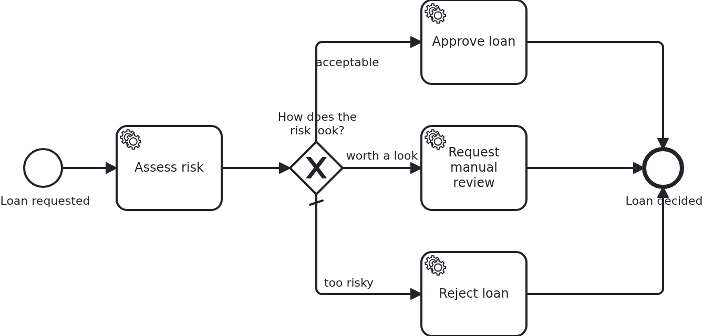

# Decoupling BPMN from the data model

[](./LICENSE)

A deployed process outlives the code around it. Instances are running on it while the data
model below them is still moving, and every attribute the model reads is a promise that the
attribute keeps its name and its meaning. This blueprint makes that promise small: the BPMN
asks questions, the workflow aggregate answers them, and only the answers are shared with the
BPMS.

## What this blueprint shows



A loan approval which rates a request, decides how risky it is, and takes one of three
branches. The risk is an enum called `RiskClass`, and nothing outside the application knows
it exists.

The model asks two questions:

```xml
<bpmn:conditionExpression>${approvableWithoutReview}</bpmn:conditionExpression>
<bpmn:conditionExpression>${worthAManualReview}</bpmn:conditionExpression>
```

The aggregate answers them, from data the model never names:

```java
@SyncWithBPMS
public boolean isApprovableWithoutReview() {
  return riskClass == RiskClass.LOW;
}
```

`riskClass` started out as a boolean called `acceptable` in the first version of this
application. Turning it into an enum was a change to Java and to one method, and neither the
BPMN nor a single running workflow noticed. Had the condition read the attribute, the same
change would have needed a new process version plus migrated data for every instance
standing at the gateway.

The second half of the blueprint is what leaves the application. The class carries
`@NoSyncWithBPMS`, so nothing is shared by default, and the two getters the model needs carry
`@SyncWithBPMS`:

```java
@NoSyncWithBPMS
public class Aggregate {
  private String customerName;   // stays here
  private Integer creditRating;  // stays here
  private RiskClass riskClass;   // stays here
}
```

What the BPMS holds is the two answers and the id of the workflow aggregate. The id is the one
value the annotations cannot keep out, because it is how VanillaBP finds the workflow again,
which is a good reason to make it a
[natural id](https://github.com/vanillabp/spi-for-java#natural-ids) of the business case:
this application uses the id of the loan request, so a workflow started twice for the same
request is a detectable duplicate rather than a second case.

Everything else stays where it was written. The customer's name is personal data and no
process needs it, the rating is an intermediate result, and the risk class is the vocabulary
of the application rather than of the model. Sharing them would mean maintaining them in two
places and answering, one day, why a name is in a BPMS backup.

The conditions have to be answerable at the same time and mean the same thing on every
engine, so they must not overlap: `isApprovableWithoutReview` and `isWorthAManualReview` are
derived from one value and cannot both be true. Two conditions that can be true at once leave
the choice to the engine, and engines answer that differently. The last branch is the default
flow, taken when neither question was answered with yes.

## Delta to the base blueprint

Compared to [`module-single`](https://github.com/vanillabp-blueprints/module-single-quarkus):

|            File            |                                          What is different                                          |
|----------------------------|-----------------------------------------------------------------------------------------------------|
| `loan_approval.bpmn`       | an exclusive gateway with a default flow, its conditions naming two getters and no attribute        |
| `Aggregate.java`           | `@NoSyncWithBPMS` on the class, `@SyncWithBPMS` on the two getters, and the data behind the answers |
| `RiskClass.java`           | the enum the model knows nothing about                                                              |
| `Service.java`             | derives the risk class from the rating and the configured thresholds, and one method per branch     |
| `WorkflowTaskHandler.java` | a `@WorkflowTask` method per branch                                                                 |
| `loan-approval.yaml`       | the two thresholds the risk class is derived from                                                   |
| `LoanApprovalIT.java`      | one test per risk class, plus one showing that the process runs without the customer's name         |

How a gateway is modelled and what a condition may read is the subject of
[`bpmn-gateways`](https://github.com/vanillabp-blueprints/bpmn-gateways-quarkus). This
blueprint takes that as given and is about what the model asks for and what the BPMS gets to
see.

## Running it

Requires a JDK 21. Camunda 7 is embedded, so nothing else has to run:

```bash
mvn install verify
```

Running it on another BPMS is a Maven profile, not one line of Java changes:

```bash
mvn install verify -Pcamunda8
```

Camunda 8 is a remote engine, so a cluster has to run. Start one; its address, and everything
else specific to that engine, lives in its profile file
`application/src/main/resources/application-camunda8.yaml`, with a copy for the module's own
test:

```yaml
vanillabp:
  adapters:
    camunda8:
      # Camunda 8 is a remote engine: point this at your cluster.
      rest-address: http://localhost:8080
```

That file is loaded because the Maven profile `camunda8` makes the config profile of the same
name the parent of whichever profile the application runs in, so the engine is chosen once, on
the Maven command line, and the build, the tests and `quarkus:dev` all follow it.

Start the application:

```bash
mvn -pl application quarkus:dev
```

Nothing about identifiers shows up at startup: the BPMS profiles of this blueprint set
`name-clash-avoidance: use-prefix`, so VanillaBP puts the workflow module ID in front of every
identifier before it reaches the engine and takes it off again on the way back. The BPMN files,
the business code and the rest of the configuration keep the plain names, and no tenant is
involved, which matters on a BPMS licensed per tenant. What the modes are and what each of them
costs is in
[the wiki](https://github.com/vanillabp/adapter-platform-integration/wiki/Workflow-modules#how-name-clashes-are-avoided).

The amount decides the risk class and with it the branch, so this is the URL to play with:

```
http://localhost:8080/api/loan-approval/start?amount=5000
```

An amount of 5000 is a rating of 50, which is at or above the configured low-risk rating of
30:

```
Loan approval '6f80…' started
Loan approval '6f80…' has a rating of 50, which is risk class LOW
Loan approval '6f80…' was approved
```

1500 gives a rating of 15, below the low-risk rating and at or above the medium one, so a
person has to look at it:

```
Loan approval 'ae8b…' has a rating of 15, which is risk class MEDIUM
Loan approval 'ae8b…' goes to a manual review
```

300 gives a rating of 3, which answers both questions with no, so the default flow is taken:

```
Loan approval 'dea6…' has a rating of 3, which is risk class HIGH
Loan approval 'dea6…' was rejected
```

The customer's name can be passed as well, and the point of it is that nothing changes when
it is:

```
http://localhost:8080/api/loan-approval/start?amount=5000&customerName=Alex%20Customer
```

It is stored with the aggregate and shown by
`http://localhost:8080/api/loan-approval/<id>`, and it never leaves the application.

Both thresholds are in the module's own configuration
(`loan-approval/src/main/resources/loan-approval/loan-approval.yaml`). Move them and the same
amounts end up in another risk class, without the model being touched.

## How it works

|                                          File                                          |                                            Role                                             |
|----------------------------------------------------------------------------------------|---------------------------------------------------------------------------------------------|
| `loan-approval/src/main/resources/loan-approval/processes/camunda7/loan_approval.bpmn` | the process: one exclusive gateway whose conditions name two getters                        |
| `.../loanapproval/model/Aggregate.java`                                                | the questions, the data behind them, and the two annotations deciding what is shared        |
| `.../loanapproval/model/RiskClass.java`                                                | the data model the BPMN does not know: three values, replaceable without a process version  |
| `.../loanapproval/Service.java`                                                        | derives the risk class from the rating and the thresholds, and does the work of each branch |
| `.../loanapproval/WorkflowTaskHandler.java`                                            | one `@WorkflowTask` method per branch, each of them forwarding to `Service`                 |
| `loan-approval/src/main/resources/loan-approval/loan-approval.yaml`                    | the thresholds, which is where a number like "30" belongs                                   |
| `loan-approval/src/test/.../LoanApprovalIT.java`                                       | one test per risk class, each one steered by the amount alone                               |

The order of events: `Service#assessRisk` writes the rating and the risk class, VanillaBP
saves the aggregate when the task handler returns and shares what the annotations allow, and
the BPMS then evaluates the conditions of the gateway. The two getters are read at that
moment, so a question is answered from what the task just computed.

`@SyncWithBPMS` on a getter is what makes this work on a BPMS which holds its own copy of the
data. Without it, an engine evaluating a condition has nothing to evaluate it on. Which
attributes an adapter shares by default, and what a nested value turns into, is in the wiki
page linked below.

## Documentation

- [Decoupling BPMN from the data model](https://github.com/vanillabp/adapter-platform-integration/wiki/Workflow-aggregates#decoupling-bpmn-from-the-data-model): the pattern this blueprint follows, and what reading an attribute costs instead
- [Sharing workflow-aggregate data](https://github.com/vanillabp/adapter-platform-integration/wiki/Workflow-aggregates#fine-grained-control-over-attributes-synchronized-to-the-bpms): `@SyncWithBPMS`, `@NoSyncWithBPMS`, and what a BPMS gets to see
- [Workflow aggregates](https://github.com/vanillabp/adapter-platform-integration/wiki/Workflow-aggregates): why there are no process variables, and what a condition can read
- [Natural ids](https://github.com/vanillabp/spi-for-java#natural-ids): the one value every BPMS is given, and why a business identifier belongs there
- [Wire up an expression](https://github.com/vanillabp/spi-for-java#wire-up-an-expression): how an expression in the model reaches your data
- the wiki of the [BPMS adapter](https://github.com/vanillabp/adapter-platform-integration/wiki/BPMS-adapters) you use: the expression language of that engine

This blueprint is developed in the monorepo
[`blueprints`](https://github.com/vanillabp-blueprints/blueprints). This repository is a
read-only mirror, **issues and pull requests belong there.**

## Noteworthy & Contributors

[VanillaBP](https://www.github.com/vanillabp/spi-for-java) was developed by [Phactum](https://www.phactum.at) with the
intention of giving back to the community as it has benefited the community in the past.


## License

Copyright 2026 Phactum Softwareentwicklung GmbH

Licensed under the Apache License, Version 2.0
